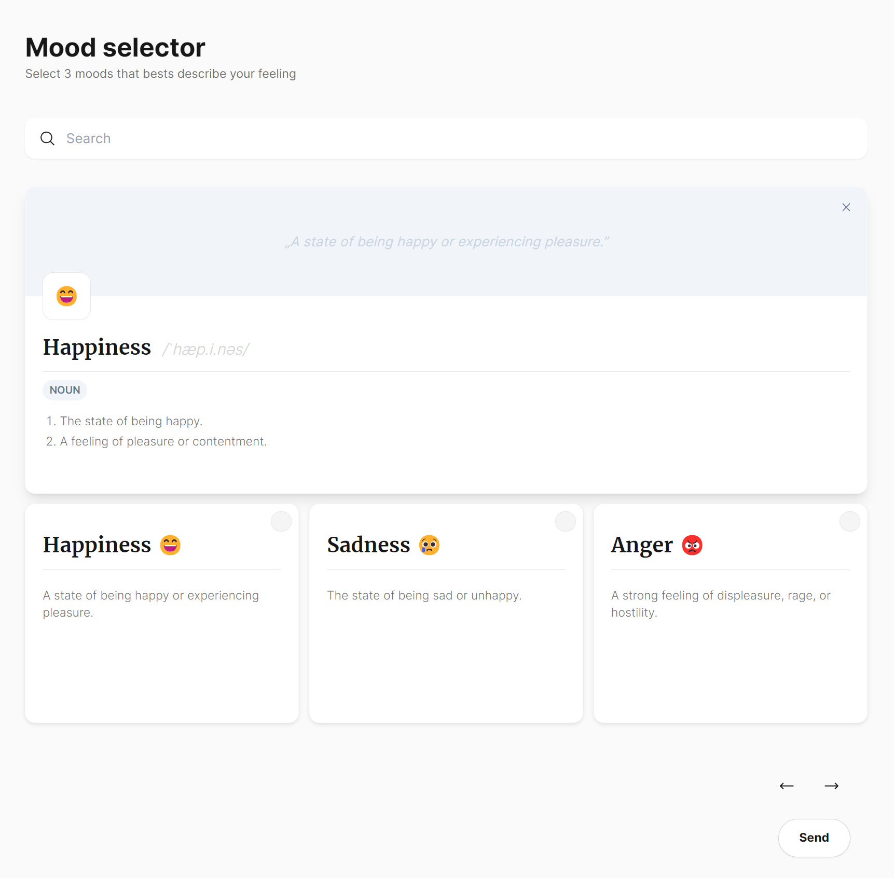

## Prelude

The following task is a great opportunity to show us your experience, style, and the way you work - and impress us with your skills and knowledge. Familiarize yourself with the information below, set up the development environment, and once everything is up and running, click on the link labeled "Start Assignment" at the bottom or navigate to `TASK.md`.

## Description

The application should display a list of moods provided by the API and allow a user to search, paginate, and submit their current mood. The current mood can consist of max three emotions, e.g. "Happy", "Excited", "Proud".

<p align="center"></p>

## General advice

- You can take a look around the project and change every part of it, but all the tasks can be achieved by:
  - Modifying the [`App.tsx`](./frontend/src/App.tsx)
  - Creating and modifying files in [`/components`](./frontend/src/components/), [`/src`](./frontend/src/) folders.
- We advise you to do the tasks in order, most of them build upon each other.

## Delivery

1. Create a branch named `solution`.
2. Complete the tasks outlined in the [`TASK.md`](./TASK.MD) file on the `solution` branch.
3. Create a PR: `master` <- `solution`.
4. Request a review from [@skorupaw](https://github.com/skorupaw).

> **It's super important to follow the instructions exactly for completing the task. If you stray, your work might not get checked!**

## Environment requirements:

```json
{
  "node": ">= 20",
  "pnpm": ">= 9"
}
```

If you don’t have pnpm installed, you can find instructions on how to set it up here: [Install pnpm](https://pnpm.io/installation#using-corepack).

## Before you start

Install the dependencies with pnpm

```cmd
pnpm install
```

To start the development run:

```cmd
pnpm run dev
```

Frontend application should be running at http://localhost:5173 and backend server at http://localhost:3000

</details>

## Final notes

- We prefer a more straightforward solution relying on pure `react` than one depending on many external tools and libraries.

- You can use [`NOTES.md`](./NOTES.md) to write down your thoughts that you may have had while completing the task. You can present your point of view or explain your thought process.

- Please provide a copy of the checklist from [`CHECKLIST.MD`](./CHECKLIST.md) and mark the implemented points.

- Please make sure that there are no console errors or bugs. It's better if some point is not delivered than if the implementation is buggy or incomplete.

- If you see any improvements that could make the app better, feel free to implement them! Just make sure they don’t impact end-to-end tests, and if they do, please adjust them accordingly.

<p align="center"><a href="./TASK.MD"><strong>Start assignment</strong></a></p>

## Disclaimer

Although we strive to provide the best possible experience and have thoroughly tested this task in various environments, due to the sheer number of different system configurations and environments, there's a small possibility that minor issues or bugs might have slipped through the cracks. If you encounter any problems, please don't feel discouraged — your effort and persistence are greatly appreciated, and we're here to support you!

## Contact

If you have any questions about the task, feel free to contact me at any point at [wojciech.skorupa@pragmile.com](mailto:wojciech.skorupa@pragmile.com). I'll reply as soon as possible.
