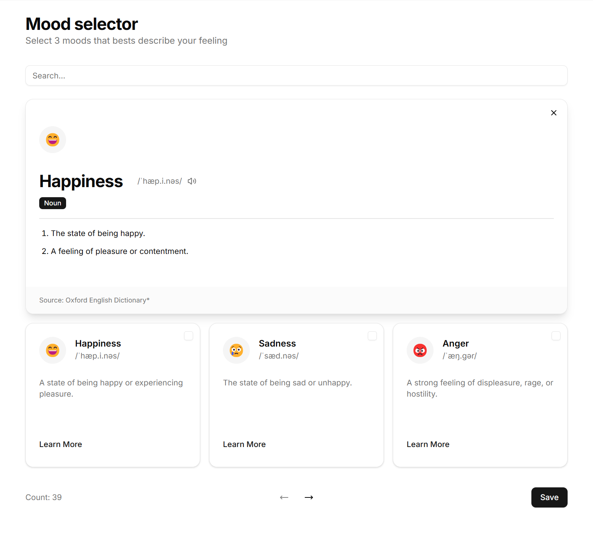

## Prelude

The following task is a great opportunity to show us your experience, style, and the way you work and impress us with your skills and knowledge. Familiarize yourself with the information below, set up the development environment, and once everything is up and running, click on the link labeled "Start Assignment" at the bottom or navigate to `TASK.md`.

## Environment requirements: 

```json
{
  "node": ">= 16.0 < 19",
  "npm": ">= 7.10"
}
```

## Description
The application should display list of moods provided by API and allow user to search, paginate and submit their current mood. Current mood can consist of max three emotions ex. "Happy", "Excited", "Proud".

<p align="center"></p>

## General advice

- You can take a look around the project and change every part of it, but all the tasks can be achieved by:
  - Modifying the [`App.tsx`](./src/App.tsx) 
  - Creating and modifying files in [`/components`](./src/components/) folder.
- We advise you to do the tasks in order, most of them built upon each other.

## Before you start

Install the dependencies with npm
```cmd
npm i
```

Start the dev server with frontend application:
```cmd
npm run dev
```

After that server should be running at: http://localhost:5173/


Now you can choose form of backend API that you want you use while completing the assignment:

<details>
<summary><strong>With REST:</strong></summary>
<p></p>
<p>Start the REST server with command:</p>


```cmd
npm run serve:rest
```
</details>

<details>
<summary><strong>With GraphQL:</strong></summary>
<p></p>
<p>Start the GraphQL server with command:</p>


```cmd
npm run serve:graphql
```
</details>

<p align="center"><a href="./TASK.MD"><strong>Start assignment</strong></a></p>
